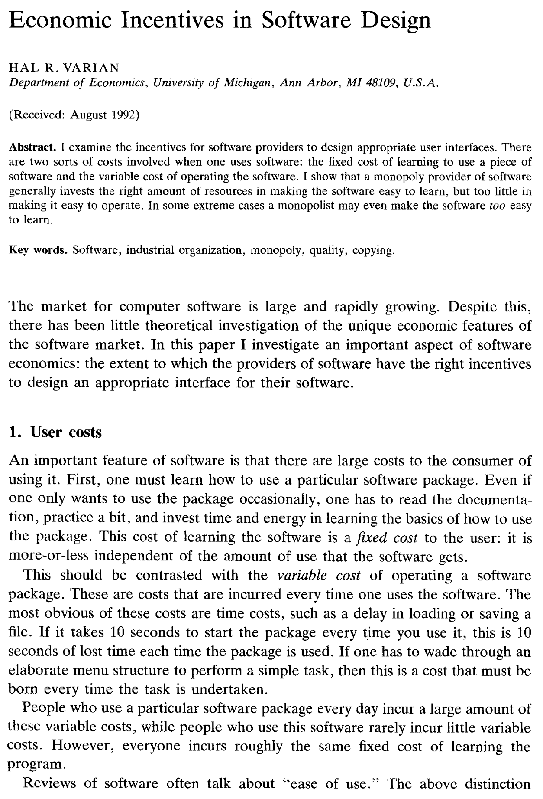
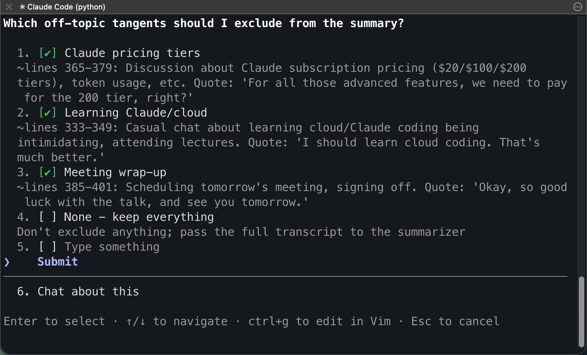

## Welcome

- TBD
- Please interrupt with questions as we go
- Slides: [ditraglia.com/coding-agents](https://ditraglia.com/coding-agents)

## Wise words from Ada Lovelace {.smaller}

::: {layout-ncol=2}

> It is desirable to guard against the possibility of exaggerated ideas that might arise as to the powers of the Analytical Engine. In considering any new subject, there is frequently a tendency, first, to *overrate* what we find to be already interesting or remarkable; and, secondly, by a sort of natural reaction, to *undervalue* the true state of the case, when we do discover that our notions have surpassed those that were really tenable.

{width="400px"}

:::

## {background-image="two-guys-bus.png" background-size="contain"}

## Coding agents vs chat

- chat: copy-paste loop
- agents: read, edit, run, iterate
- plan → act → observe → revise
- self-correction (coding has built-in verification)

## {background-image="claude-code-in-action.png" background-size="contain"}

## How to access

- Terminal: `claude` / `codex`
- VS Code / Cursor extensions
- Desktop app
- Web: [claude.ai/code](https://claude.ai/code) · [chatgpt.com/codex](https://chatgpt.com/codex)
- Docs: [code.claude.com/docs](https://code.claude.com/docs/en/overview) · [developers.openai.com/codex](https://developers.openai.com/codex)

## {background-image="claude-code-VScode.png" background-size="contain"}

## Sandboxing & safety

- permissions: what it can do / when it asks
- defaults: read-mostly, no internet
- levels: ask-all → folder-bounded → isolated env
- version control = safety net

## Unexploited individual productivity

::: {layout-ncol=2}

- unknown unknowns
- typing → 1 month → 10 years
- couldn't have known the upside
- forcing function (hand pain)
- cost of finding out is now small

{width="400px"}

:::

## Varian + the open-source flip

::: {layout-ncol=2}

- Varian (1993)
- commercial: friendly-but-shallow
- open-source: powerful-but-hard
- intensive user squeezed both sides
- Overleaf as case

:::

## Two inefficiencies, one tool

- 1\. market: underprovides power
- 2\. individual: unknown unknowns
- same tool, different channels
- you = social planner for your own tool

## Command-line concierge

> "I like to think of Claude — and ChatGPT too, I'm gonna refer to Claude quite often because I tend to like Claude a lot — as my command line concierge."

> "Back in the old days, what would you do? You need to spend your time diagnosing complex, weird, subtle issues on Stack Overflow, trying to read the Linux documentation, trying to master obscure tools like sed and awk that are indeed very, very powerful tools for processing text. And these days, I'm not saying that the value of those things is gone. It is actually still incredibly valuable to know a little bit about those things, but it's now become very cheap to be able to learn about those things."

## Linux philosophy

- one tool for the job
- specialized model per task
- frontier at every step
- swappable components
- the glue is yours

## qsf converter

- tedious survey building
- tried direct → failed without examples
- separate Claude found UCSB examples
- worked first try
- Claude wrote its own guide
- Blog post: [adventures with Claude Code and Qualtrics](https://unsolictedreviews.substack.com/p/adventures-with-claude-code-and-qualtrics)

## Referee recommender

- Qwen3-Embedding-8B (local, Ollama)
- cosine similarity + author aggregation
- deployed HF Spaces, free CPU tier
- Ollama vs MLX: 1.5× on M4 Max
- Live: [huggingface.co/spaces/fditraglia/referee-recommender](https://huggingface.co/spaces/fditraglia/referee-recommender)
- Source: [github.com/fditraglia/econbase-abstracts](https://github.com/fditraglia/econbase-abstracts)

## {background-image="zoom-summary-1.png" background-size="contain"}

##

{.r-stretch}

## More tools

- whisper-dictation: [github.com/fditraglia/whisper-dictation](https://github.com/fditraglia/whisper-dictation)
- econometrics.blog: [econometrics.blog](https://www.econometrics.blog) · [source](https://github.com/fditraglia/econometrics.blog)
- restatr / ivreg2r: [restatr.com](https://restatr.com) · [github.com/restatr/ivreg2r](https://github.com/restatr/ivreg2r)
- Castle Adamant: [github.com/fditraglia/castle-adamant](https://github.com/fditraglia/castle-adamant)

## The jagged frontier

- Mollick et al.
- tasks of equal difficulty land on opposite sides
- frontier moves outward
- auto-memory across sessions

## Scaffolding

- CLAUDE.md / AGENTS.md
- custom tools
- locked-in defaults
- Claude can build the scaffolding for you

## Imaginative learning and use

- imaginative — not the marginal user
- learning — primitives compound
- use — low stakes, fast feedback
- tinker. don't be a passenger.

## Where to go next

- Claes Backman, *Claude Code for Academic Economists*: [claesbackman.com/claude-code-guide.html](https://claesbackman.com/claude-code-guide.html)
- Chris Blattman: [claudeblattman.com](https://claudeblattman.com)
- Simon Willison, *Agentic Engineering Patterns*: [simonwillison.net/guides/agentic-engineering-patterns](https://simonwillison.net/guides/agentic-engineering-patterns/)
- Slides: [ditraglia.com/coding-agents](https://ditraglia.com/coding-agents)
